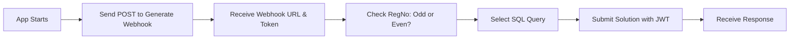

# Bajaj Finserv Health - Webhook Application

A Spring Boot application that automatically generates webhooks, solves SQL problems, and submits solutions to the Bajaj Finserv Health hiring challenge.

## 📋 Overview

This application:
1. Sends a POST request on startup to generate a webhook URL and access token
2. Determines which SQL question to solve based on your registration number (odd/even)
3. Submits the SQL solution to the webhook URL with JWT authentication

## 🚀 Quick Start

### Prerequisites

- **Java 17** or higher
- **Maven** (or use the included Maven Wrapper)
- **Git**

Check Java version:
```bash
java -version
```

### Installation

1. **Clone the repository**
```bash
git clone https://github.com/YOUR_USERNAME/webhookapp.git
cd webhookapp
```

2. **Configure your details**

Edit `src/main/resources/application.properties`:
```properties
# IMPORTANT: Update these with your actual details
user.name=Your Full Name
user.regNo=REG12347
user.email=your.email@example.com
```

3. **Add your SQL solutions**

Edit `src/main/java/com/bajajitest/webhookapp/service/SqlQueryService.java`:

- For **ODD** registration numbers: Update `getQuestion1Query()` method
- For **EVEN** registration numbers: Update `getQuestion2Query()` method

Download the question PDFs:
- [Question 1 (Odd)](https://drive.google.com/file/d/1LAPx2to9zmN5NDY0tkMrJRnVXf1guNr/view?usp=sharing)
- [Question 2 (Even)](https://drive.google.com/file/d/1b0p5C-6fUrUQglJVaWWAAB3P12IfoBCH/view?usp=sharing)

## 🔨 Build & Run

### Option 1: Using Maven Wrapper (Recommended - No Maven installation needed)

**Build the project:**
```bash
./mvnw clean package
```

**Run the application:**
```bash
java -jar target/webhookapp.jar
```

### Option 2: Using Installed Maven

**Build the project:**
```bash
mvn clean package
```

**Run the application:**
```bash
java -jar target/webhookapp.jar
```

### Option 3: Using Maven Spring Boot Plugin

```bash
./mvnw spring-boot:run
```

## 📦 Download JAR

After building, the JAR file will be available at:
```
target/webhookapp.jar
```

**Direct download link for submissions:**
```
https://github.com/YOUR_USERNAME/webhookapp/raw/main/target/webhookapp.jar
```

## 📁 Project Structure

```
webhookapp/
├── src/
│   ├── main/
│   │   ├── java/com/bajajitest/webhookapp/
│   │   │   ├── WebhookappApplication.java          # Main application class
│   │   │   ├── config/
│   │   │   │   └── RestTemplateConfig.java         # REST client configuration
│   │   │   ├── model/
│   │   │   │   ├── WebhookRequest.java             # Request model for webhook generation
│   │   │   │   ├── WebhookResponse.java            # Response model from webhook API
│   │   │   │   └── SolutionRequest.java            # Request model for solution submission
│   │   │   ├── service/
│   │   │   │   ├── WebhookService.java             # Handles API calls
│   │   │   │   └── SqlQueryService.java            # Manages SQL query selection
│   │   │   └── runner/
│   │   │       └── StartupRunner.java              # Executes workflow on startup
│   │   └── resources/
│   │       └── application.properties               # Configuration file
│   └── test/
├── pom.xml                                          # Maven configuration
└── README.md
```

## 🔧 Configuration

### Application Properties

| Property | Description | Example |
|----------|-------------|---------|
| `user.name` | Your full name | `John Doe` |
| `user.regNo` | Your registration number | `REG12347` |
| `user.email` | Your email address | `john@example.com` |
| `server.port` | Application port | `8080` |

### API Endpoints Used

| Endpoint | Method | Purpose |
|----------|--------|---------|
| `/hiring/generateWebhook/JAVA` | POST | Generate webhook and access token |
| `/hiring/testWebhook/JAVA` | POST | Submit SQL solution |

## 📊 How It Works

### Workflow Sequence



### Registration Number Logic

- **Last 2 digits are ODD** → Question 1 SQL query
- **Last 2 digits are EVEN** → Question 2 SQL query

Example:
- `REG12347` → Last 2 digits: `47` (ODD) → Question 1
- `REG12348` → Last 2 digits: `48` (EVEN) → Question 2

## 📝 Example Output

```
================================================================================
APPLICATION STARTED - Beginning Webhook Flow
================================================================================

--- STEP 1: Generating Webhook ---
POST URL: https://bfhldevapigw.healthrx.co.in/hiring/generateWebhook/JAVA
Webhook generated successfully!
Webhook URL: https://bfhldevapigw.healthrx.co.in/hiring/testWebhook/JAVA
Access Token: eyJhbGciOiJIUzI1NiIsInR5cCI6IkpXVCJ9...

--- STEP 2: Determining SQL Query ---
Last two digits: 47
Registration number is: ODD
Using Question 1 SQL Query

--- STEP 3: Submitting Solution ---
Submitting solution to webhook...
SQL Query: SELECT column1, column2 FROM table WHERE...
Solution submitted successfully!

================================================================================
WORKFLOW COMPLETED SUCCESSFULLY!
Final Response: {"status":"success","message":"Solution accepted"}
================================================================================
```

## 🐛 Troubleshooting

### Maven command not found

Use the Maven Wrapper instead:
```bash
./mvnw clean package
```

### Permission denied: ./mvnw

Make it executable:
```bash
chmod +x mvnw
```

### Java version error

Ensure Java 17+ is installed:
```bash
java -version
```

Install Java 17:
```bash
# Ubuntu/Debian
sudo apt update
sudo apt install openjdk-17-jdk

# Verify
java -version
```

### Connection timeout

Check your internet connection and firewall settings. The application needs to access:
- `https://bfhldevapigw.healthrx.co.in`

## 📚 Dependencies

- **Spring Boot 3.2.0** - Application framework
- **Spring Web** - REST client and web support
- **Lombok** - Reduce boilerplate code
- **Jackson** - JSON processing

## 🔒 Security Notes

- The application uses JWT (JSON Web Token) for authentication
- Access tokens are received from the webhook generation API
- Tokens are automatically included in the Authorization header

## 📤 Submission

For the Bajaj Finserv Health challenge, submit:

1. **GitHub Repository Link:**
   ```
   https://github.com/YOUR_USERNAME/webhookapp.git
   ```

2. **JAR Download Link:**
   ```
   https://github.com/YOUR_USERNAME/webhookapp/raw/main/target/webhookapp.jar
   ```

## 🤝 Contributing

This is a challenge submission project. If you're working on the same challenge:
1. Fork this repository
2. Update with your own details
3. Add your SQL solutions
4. Submit your own version

## 📄 License

This project is created for the Bajaj Finserv Health hiring challenge.

## 👤 Author

**Your Name**
- GitHub: [@YOUR_USERNAME](https://github.com/YOUR_USERNAME)
- Email: your.email@example.com

## 🙏 Acknowledgments

- Bajaj Finserv Health for the coding challenge
- Spring Boot framework
- Java community

---

**Note:** Remember to replace `YOUR_USERNAME` with your actual GitHub username before submitting!

## ⚡ Quick Commands Reference

```bash
# Clone
git clone https://github.com/YOUR_USERNAME/webhookapp.git

# Build
./mvnw clean package

# Run
java -jar target/webhookapp.jar

# Test
./mvnw test

# Clean
./mvnw clean
```

Good luck with your submission! 🚀
